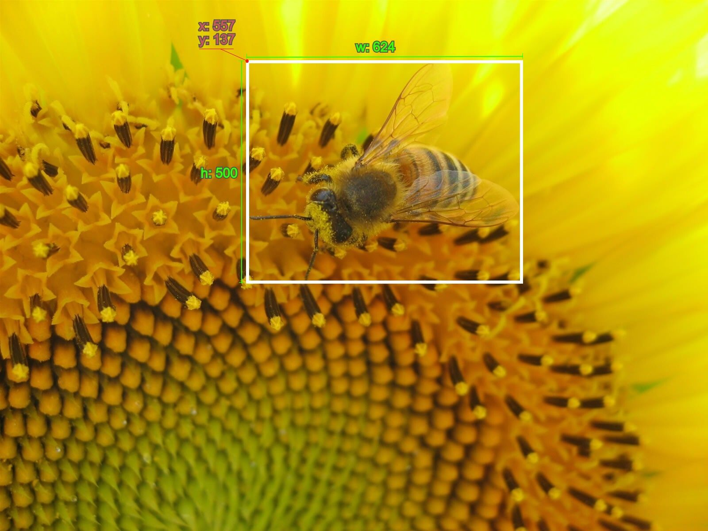

# Zentangle Smart Contract

## Table of Contents
1. [Introduction](#introduction)
2. [Summary](#summary)
3. [Structure](#structure)
4. [Algorithms](#algorithms)
5. [Deploy Locally](#deploy-locally)

## Introduction
Decentralized Tagging is a way to tag images given a certain descriprion, but in a decentralized and incentivazed way. This tagged images can then be used to train a Deep Learning algorithm to recognize an object in an image. Zentangle consists of taking a usually tedious and monotone task of spending many hours tagging images, and making it a game, where anyone can not only tag images given a description and recieve rewards for it, but bet against other players on their tags being the most precise.

A tag consists of a rectangle inside an image represented by a four dimentional point, one dimention for each component of the tag: x and y positions of the upper left corner of the tag, h for the hight of the rectangle and w for it’s width. And example can be seen in image 1.


## Summary
The SC has the purpose of taking data and a reward from a researcher that wants to get the images tagged and making sure that users that tag images (taggers) make correct tags. If they dont, discard the data and do not reward them for the wrong tags. On the other hand, the SC accepts payments from the taggers that want to bet that their tags are the best and then, at the end, distributes that money in an exponential function given the taggers position in the top list.

The steps that follows the SC in a normal round are as follows:

* A researcher creates a round, specifying the amount of images to tag, a description of how to tag them and the amount of players to tag every image.

* A player requests to tag an image and can place a bet.

* The SC chooses an image randomly and returns it’s id to the player.

* The player tags the image and sends the tagging data to the SC, witch stores it.

* After many players have tagged images, the researcher decides to end the round.

* The SC takes all the tagging data and, for every image, calculates clusters of four dimentional points representing the tags. Small clusters get discarted as invalid tags. Then, it pays for every valid tag equally with the money placed by the researcher.

* The SC calculates the player’s ranking based on the valid tag’s distance to the center of their respective clusters. It proceeds to order a list of all players with a valid tag, given their best tag (with the shortest distance to the cluster’s center). The best players get exponentially better payouts, allways proportional to their cumullative bets.

Now, let’s dive deeper into the details.

## Structure
The smart contract consists of four main functions: createRound , requestPlay , sendTags and endGame plus three functions related to the owner of the smart contract: init, setOwner and withdraw. There are also state variables that store key information for the functioning of the SC:

```
"state": {
		"owner": "AgentID // current owner of this smart contract",
		"numberOfImages": "Int32 // total number of images to tag",
		"reward": "Int64 // current reward to split between players",
		"description": "String // details on how should the images be tagged",
		"creator": "AgentID // the creator of the game",
		"tagsRequiredPerImage": "Int32 // Images have to be tagged by this amount of players to be ready",
		"bets": "Bet[]",
		"pendingPlay": "map[String]Bet // maps a players address to the Play that has been requested but not completed",
        "playsPerImage": "Int32[] // counts how many times an image has been tagged",
        "taggedImages": "TaggedImage[] // a list with every TaggedImage (many per imageId) TODO: Ideally a nested array when it gets implemented",
        "validTags": " ValidTag[] // stores the player and imageId of all valid tags",
        "processedImages": "TaggedImage[]",
        "player": "map[String]Player // maps an address to the information of the player"
	}
```
To understand these, it is also necessary to know the TaggedImage , Bet, ValidTag and Player structs:

```"TaggedImage": {
	"imageId": "Int32",
	"player": "AgentID // player that has tagged this image",
	"boost":"String // if the tags will be boosted or not",
	"x": "String // x top-left positions of the Tags",
	"y": "String // y top-left positions of the Tags",
	"w": "String // widths of the Tags",
	"h": "String // heights of the Tags"
},
"Bet": {
	"amount": "Int64",
	"player": "AgentID // player placing the bet",
	"imageId": "Int32"
},
"ValidTag": {
	"player": "AgentID // player placing the bet",
	"taggedImage": "Int32",
	"playTagId": "Int32 // Identifier to distinguish different tags in the same play"
},
"Player": {
	"playerId": "AgentID // The player",
	"nTags": "Int64 // Number of tags made by the player in the current round",
	"nDoubleBoosts": "Int64 // Number of 2x boost used in the round",
	"nTrippleBoosts": "Int64 // Number of 3x boosts used in the round"
}
```
The descriptions and names leave it clear what they are for, with exception perhaps of some of the last state variables. taggedImages is a list of TaggedImages and it stores all the plays that have been made in the round, so at the end we should have a length of exactly  numberOfImages times tagsRequiredPerImage. 

The TaggedImage struct has the imageId of the image being tagged, the player that tagged the image (in some aplications is left with a default value) and the information of the many tags it contains. Note that x, y, h, w and boost are strings. These strings contain n amount of variables, one for every tag and are separated using spaces.

On the other hand, processedImages refers to the images that are the final tags, that is, after the clusterization algorithm, we are left with the four-dimentional centers of the clusters, that represent the average x, y, h and w of a valid tag. This is the output data that can be used to train a Deep Learning algorithm.

Lastly, the playerstate variable is here to keep track of the amount of boosts that the players have used and the amount of tags they have made. This is used to check if they can use a 2x or 3x boost.

## Algorithms
### Clusterization algorithm
The clusterization algorithm used to merge the tags that are close to eachother is called “Aglomerative Hierarchical Clusterization Algorithm“. This algorithm, unlike most of other clusterization algorithms, doesn't take as manual input the amount of clusters to consider. This is important, because we do not know how many they will be. It does require a manual input tho, and it is the distance at which it will no longer merge two particular clusters.

The  “Aglomerative Hierarchical Clusterization Algorithm“ works as follows: 

* Every point starts as a cluster

* Find the two closests clusters

* Merge those clusters into one cluster. In our case, we set it’s new coordinates as the average of all points inside both clusters. This is because our clusters normally take a circular shape.

* Repeat this step until the two closest clusters are further away than the minimum distance set in the MIN_INTER_CLUSTER_DISTANCE constant. 

In our Smart Contract, we also count the amount of points inside of the clusters. If it is less than X% of players, set by the CONFIRMATION_PERCENTAGE constant, then the cluster is discarted, and not considered for the results.

### Reward algorithms
There are two kinds of rewards for players. Both of this rewards only apply for valid tags.

The first reward is paid with the funds given by the researcher and is split equally between all valid tags. This way, players get rewarded proportionally to their contribution.

The second reward comes from the betting money. For this reward, the calculation is as follows:

* List all bets that come with a valid tag (using the list from first reward)

* Filter the ones who's players are repeated, leaving only the best bet by accuracy

* Calculate the total amount of iotas betted by each of theese players

* Sort the bets list by tag accuracy

* Calculate the total amount of iotas betted

* Pay each player on the bets list the following amount: 

`position²*boost*amount_betted*const`

where:

position: the players position on the list, where higher is better. Ties exist.

boos: the boost constant of the tag

amount_betted: the total amount betted by the player in the round

const: calculated so that the sum of all payouts is equal to the total amount of iotas betted

## Deploy locally
First, you want to clone the GitHub wasp repository from the IOTA foundation: [GitHub - iotaledger/wasp at develop](https://github.com/iotaledger/wasp/tree/develop)

You also want to have the wasm file of the smart contract you want to deploy.

When that is done, you will want to build all the tools that come with the wasp repo. We will use the wasp tool to run a local node and the `wasp-cli` to interact with the smart contract. Make sure you have go installed (at least version 1.16.1+ or else you will get an error `cannot load embed: malformed module path "embed": missing dot in first path element`) and on the path.

`make install`

`make`

After this, create a folder inside the wasp folder, called wasp-node. In this folder, we will store the database of the wasp node, the config file and also the log file. Copy the `config.json` file inside of this folder. The other files will be generated after initializing the server. Change the file to connect to the IF's GoShimmer node by changing the `nodeconn` address to `goshimmer.sc.iota.org:5000`. This way, we won’t have to run a GoShimmer node as well.

If you are wondering why we are running our own wasp node, it’s because this way we can deploy new smart contracts. In other nodes this is usually blocked for outsiders.

To start the wasp node, run this command:

`../wasp --logger.level="warn"`

Next, let’s set up a wasp-cli wallet. Start by initializing with `./wasp-cli init` on the wasp folder. This will create a `wasp-cli.json` with a seed. Open the `wasp-cli.json` and edit it to connect to the GoShimmer node of the IF and to the local wasp node. It should look something like this:

```{
  "goshimmer": {
    "api": "https://api.goshimmer.sc.iota.org"
  },
  "wallet": {
    "seed": "whatever random seed was generated"
  },
  "wasp": {
    "0": {
      "api": "127.0.0.1:9090",
      "nanomsg": "127.0.0.1:5550",
      "peering": "127.0.0.1:4000"
    }
  }
}
```
If GoShimmer node is ok, you should be able to get iotas from the faucet. Run `./wasp-cli request-fundsand` then `./wasp-cli balance`. You should see 1 Miota in your wallet.

Next, run the following command to deploy a chain:

`./wasp-cli chain deploy --committee=0 --quorum=1 --chain=mychain --description="Test Chain"`

You can see the chains with their smart contracts in `http://localhost:7000/`.

Let’s send some balance to the chain, before deploying the smart contract:

`./wasp-cli chain deposit IOTA:10000`

`./wasp-cli chain deploy-contract wasmtime zentangle "Zentangle SC" ./zentangle/pkg/zentangle_bg.wasm`

The `./zentangle/pkg/zentangle_bg.wasm` file is the compiled smart contract. If it doesn’t exist, create it by running `wasm-pack build` inside of the `zentangle` folder. If `wasm-pack` is not installed, do it with: `curl https://rustwasm.github.io/wasm-pack/installer/init.sh -sSf | sh`.
But for this you also need to install rust: https://www.rust-lang.org/tools/install

Now, let’s interact with the smart contract. First, run createGame. Here we are establishing 2 images to tag, with a description saying “test game“ and a reward of 10000 iotas. We are letting the tagsRequiredPerImage parameter blank, so it will be set to the default of 10.

`./wasp-cli chain post-request zentangle createGame string numberOfImages int32 2 string description string "test game" -t IOTA:10000`

Next, we request to play and place a bet of 10000 iotas and then send an imageTag:

`./wasp-cli chain post-request zentangle requestPlay -t IOTA:10000`

`./wasp-cli chain post-request zentangle sendTags string inputJson string '{"x": [50, 200, 500], "y": [100, 250, 550], "h": [150, 50, 50], "w": [200, 50, 55], "boost": [1, 1, 1]}'`

You can repeat this step as many times as you want, with different coordinates of tags and different bets. You can also send them from different wallets.

Finally, we end the game by running `./wasp-cli chain post-request zentangle endGame` from the wallet the game was created.

To see the results of a particular image, run:

`./wasp-cli chain call-view zentangle getResults string imageId int32 0 | ./wasp-cli decode string results string`
 

## References: 
[Exploring IOTA 2.0 Smart Contracts in a Private Network: Developing a Prediction Market](https://medium.com/51nodes/exploring-iota-2-0-smart-contracts-in-a-private-network-developing-a-prediction-market-c2d81988f75e)
[Setting Up a Chain | IOTA Wiki](https://wiki.iota.org/wasp/guide/chains_and_nodes/setting-up-a-chain)
